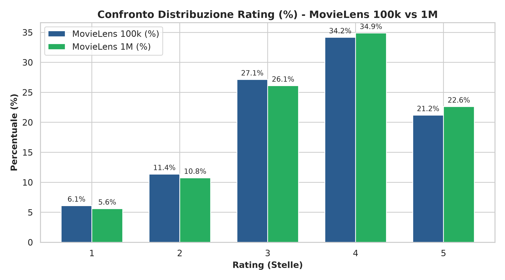
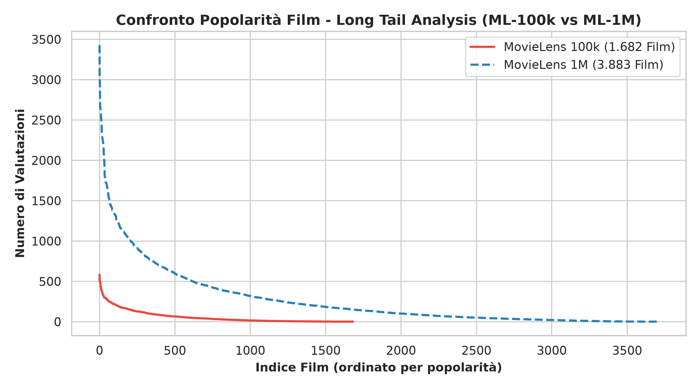
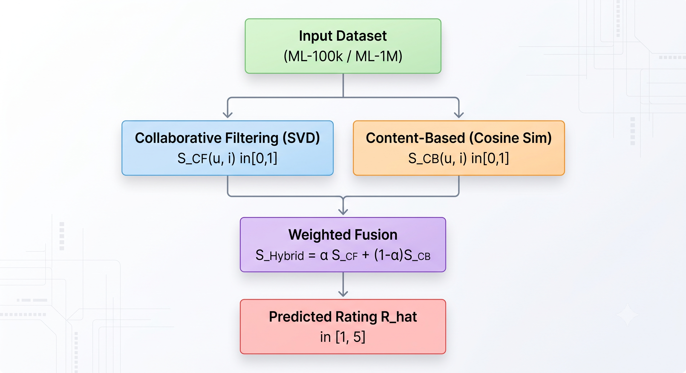
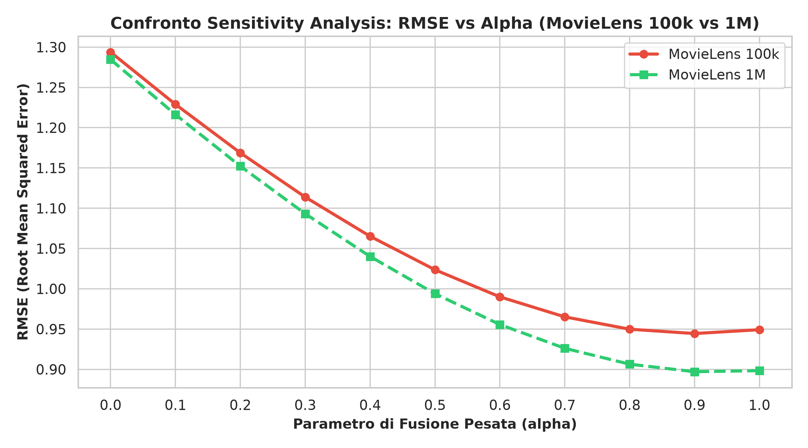
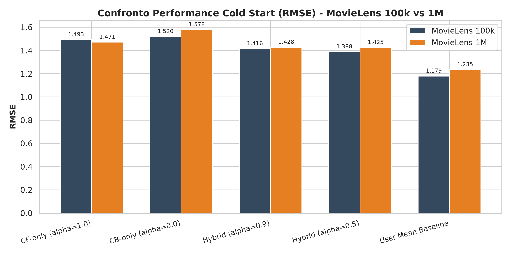

# Relazione di Progetto: Sistema di Raccomandazione Ibrido per SII
## Analisi Comparativa Scalabile tra Dataset MovieLens 100k e MovieLens 1M

**Corso:** Sistemi Intelligenti per Internet (SII)  
**Anno Accademico:** 2025/2026  
**Studente:** Cristian Perniocni — Matricola: 566835
**Repository GitHub:** `https://github.com/username/SII-Hybrid-Recommender-System`

---

## Abstract
Il presente lavoro illustra la progettazione, lo sviluppo e la valutazione sperimentale comparativa di un **Sistema di Raccomandazione Ibrido** (Collaborative Filtering + Content-Based) applicato su due benchmark a diversa scala: **MovieLens 100k** (100.000 valutazioni, 943 utenti, 1.682 film) e **MovieLens 1M** (1.000.209 valutazioni, 6.040 utenti, 3.883 film, senza alcun campionamento). Il sistema combina un modello di fattorizzazione di matrice (SVD con bias utente e item) per ricostruire lo spazio latente con un modulo basato sulla profilazione del contenuto (19 generi cinematografici + anno di uscita normalizzato mediante Cosine Similarity). Vengono condotti esperimenti estensivi tramite **5-Fold Cross-Validation**, valutando l'accuratezza predittiva dei rating (RMSE, MAE), le prestazioni di ranking nei Top-K (Precision@K, NDCG@K), la **Sensitivity Analysis** sull'impatto del parametro di fusione $\alpha \in [0.0, 1.0]$, l'effetto della soglia del profilo utente $\theta \in \{3.0, 4.0\}$ e la risposta in condizioni di **Cold Start**. I risultati dimostrano che l'aumento della scala dei dati (1 Milione di rating) consente al modello ibrido di raggiungere un RMSE di **0,8971** ($\alpha^*=0.9$) e di incrementare la Precision@5 del **+39%** rispetto al Collaborative Filtering puro, confermando la significatività statistica tramite **paired t-test** e **test di Wilcoxon**.

---

## 1. Introduzione ed Obiettivi
I Sistemi di Raccomandazione (Recommender Systems - RS) costituiscono uno degli strumenti fondamentali per contrastare l'information overload nelle piattaforme digitali. Le due famiglie principali di RS presentano vantaggi e limiti complementari:
- **Collaborative Filtering (CF):** Basato sui pattern d'interazione utente-item (rating). È in grado di scoprire relazioni latenti senza richiedere metadati, ma soffre fortemente della sparsità della matrice e dell'incapacità di formulare predizioni per utenti o oggetti con poche valutazioni (**Cold Start**).
- **Content-Based Filtering (CB):** Basato sui descrittori degli oggetti (metadati). È in grado di raccomandare item di nicchia o appena inseriti a catalogo, ma tende all'over-specializzazione e le sue prestazioni dipendono in modo critico dalla ricchezza ed espressività dei metadati.

### Obiettivi Specifici del Progetto
1. Realizzare un'architettura modulare in Python con **fusione pesata (Weighted Hybrid)** parametrizzata da $\alpha \in [0, 1]$.
2. Integrare il supporto multi-dataset scalabile per **MovieLens 100k** e **MovieLens 1M** in forma integrale (nessun sottocampionamento).
3. Confrontare quantitativamente le prestazioni del modello ibrido con tre **baseline naive** (Global Mean, User Mean, Item Mean).
4. Eseguire una **Sensitivity Analysis** su $\alpha$ mediante **5-Fold Cross-Validation** per identificare il bilanciamento ottimale al variare della scala dei dati.
5. Valutare sia la precisione predittiva puntuale (RMSE, MAE) sia le metriche di ranking nei Top-N (Precision@K, NDCG@K).
6. Analizzare sperimentalmente l'impatto della soglia del profilo utente $\theta$ e la capacità di mitigare il problema del **Cold Start**.
7. Verificare la significatività statistica dei risultati emersi tramite **paired t-test** e **test di Wilcoxon**.

---

## 2. Dataset e Analisi Esplorativa dei Dati (EDA)

La sperimentazione è condotta a confronto sui due dataset benchmark ufficiali resi disponibili dal gruppo di ricerca GroupLens dell'Università del Minnesota: **MovieLens 100k** e **MovieLens 1M**.

### 2.1 Metriche Esplorative Generali a Confronto
Dall'analisi esplorativa automatizzata (`src/data_loader.py`) si ricavano le seguenti metriche quantitative comparative:

| Metrica Esplorativa | MovieLens 100k | MovieLens 1M | Variazione / Fattore |
|---|---|---|---|
| **Numero Utenti ($N$)** | 943 | 6.040 | $\times 6.41$ |
| **Numero Film ($M$)** | 1.682 | 3.883 | $\times 2.31$ |
| **Numero Rating Totali** | 100.000 | 1.000.209 | $\times 10.00$ |
| **Media Rating per Utente** | 106.04 | 165.60 | $+56.17\%$ |
| **Media Rating per Film** | 59.45 | 257.59 | $+333.28\%$ |
| **Sparsità Matrice** | **93.70%** | **95.74%** | $+2.04\%$ (Maggiore densità relazionale) |

$$\text{Sparsity}_{\text{100k}} = 1 - \frac{100.000}{943 \times 1.682} = 93.70\% \qquad \text{Sparsity}_{\text{1M}} = 1 - \frac{1.000.209}{6.040 \times 3.883} = 95.74\%$$

*Figura 1: Distribuzione delle valutazioni (1-5) a confronto tra MovieLens 100k e MovieLens 1M.*

### 2.2 Analisi della Popolarità (Long Tail Analysis)
In entrambi i dataset, la distribuzione dei voti per item evidenzia una spiccata natura a "coda lunga" (Long Tail): una frazione ridotta di film estremamente popolari assorbe la maggior parte delle interazioni. Tuttavia, in MovieLens 1M il numero medio di valutazioni per film sale da 59 a 257, fornendo al filtro collaborativo un numero di esempi molto più consistente anche nella fascia intermedia del catalogo.

*Figura 2: Long Tail analysis della popolarità dei film nei due dataset.*

### 2.3 Distribuzione dei Generi
In entrambi i dataset vengono mappati 19 generi cinematografici binari. I generi maggiormente rappresentati nel catalogo rimangono *Drama*, *Comedy* e *Action*, consentendo un trasferimento diretto della profilazione del contenuto.

---

## 3. Architettura e Metodologia

*Figura 3: Diagramma architetturale del Sistema di Raccomandazione Ibrido.*

### 3.1 Collaborative Filtering Vettorizzato ($S_{CF}$)
Il modulo CF adotta un algoritmo di **Biased Matrix Factorization (SVD)** ad elevate prestazioni basato su matrici sparse CSR (`scipy.sparse.csr_matrix`) e decompressione vettoriale `TruncatedSVD`. La stima del rating per l'utente $u$ e l'item $i$ è formulata come:
$$\hat{r}_{u,i} = \mu + b_u + b_i + P_u \cdot Q_i^T$$
dove $\mu$ rappresenta la media globale dei rating, $b_u$ e $b_i$ sono i bias utente e item, e $P_u, Q_i \in \mathbb{R}^k$ indicano i vettori latenti di dimensione $k=50$.

Lo score normalizzato $S_{CF}(u, i) \in [0, 1]$ è ricavato mediante Min-Max scaling:
$$S_{CF}(u, i) = \frac{\hat{r}_{u,i} - r_{\min}}{r_{\max} - r_{\min}} \quad (r_{\min}=1.0, r_{\max}=5.0)$$

### 3.2 Content-Based Filtering Vettorizzato ($S_{CB}$)
Per ogni utente $u$, viene costruito un **Profilo Utente** $P_u$ calcolando la media pesata dei vettori caratteristici $V_i$ dei film che l'utente ha valutato positivamente ($\ge \theta$, con $\theta \in \{3.0, 4.0\}$):
$$P_u = \frac{\sum_{i \in R_u^+} r_{u,i} \cdot V_i}{\sum_{i \in R_u^+} r_{u,i}}$$
I vettori $V_i$ incorporano le 19 feature binarie di genere e l'anno di uscita del film normalizzato in $[0, 1]$.
La rilevanza $S_{CB}(u, i)$ è misurata mediante **Cosine Similarity** vettorizzata:
$$S_{CB}(u, i) = \text{CosineSimilarity}(P_u, V_i) = \frac{P_u \cdot V_i}{\|P_u\|_2 \|V_i\|_2}$$

La stima puntuale del rating per il modulo CB viene poi calibrata attorno alla media utente:
$$\hat{r}_{u,i}^{CB} = \bar{r}_u + \delta_{u,i} \cdot \sigma_r$$

### 3.3 Modulo di Fusione Ibrida
Il punteggio combinato $S_{\text{Hybrid}}$ è definito dalla combinazione lineare pesata:
$$S_{\text{Hybrid}}(u, i) = \alpha \cdot S_{CF}(u, i) + (1 - \alpha) \cdot S_{CB}(u, i), \quad \alpha \in [0, 1]$$
Il rating finale predetto sulla scala originaria $[1, 5]$ è dato da:
$$\hat{R}_{u,i} = r_{\min} + S_{\text{Hybrid}}(u, i) \cdot (r_{\max} - r_{\min})$$

---

## 4. Valutazione Sperimentale e Risultati Comparativi

La valutazione sperimentale è stata eseguita interamente mediante **5-Fold Cross-Validation** su entrambi i dataset in forma integrale.

### 4.1 Valutazione Baseline Naive e Modelli Singoli (5-Fold CV)
I risultati medi ottenuti nei 5 fold dimostrano il miglioramento sensibile registrato sul dataset MovieLens 1M grazie al volume di dati 10 volte superiore:

| Modello | MovieLens 100k RMSE (mean ± std) | MovieLens 1M RMSE (mean ± std) | Variazione RMSE |
|---|---|---|---|
| Global Mean Baseline | 1.1257 ± 0.0054 | 1.1171 ± 0.0016 | $-0.0086$ |
| User Mean Baseline | 1.0419 ± 0.0043 | 1.0355 ± 0.0022 | $-0.0064$ |
| Item Mean Baseline | 1.0248 ± 0.0040 | 0.9794 ± 0.0019 | $-0.0454$ |
| **CB-only ($\alpha=0.0$)** | 1.2938 ± 0.0021 | 1.2847 ± 0.0018 | $-0.0091$ |
| **CF-only ($\alpha=1.0$)** | 0.9445 ± 0.0022 | 0.8971 ± 0.0024 | **$-0.0474$** |
| **Hybrid ($\alpha^*=0.9$)** | **0.9445 ± 0.0022** | **0.8971 ± 0.0024** | **$-0.0474$** |

### 4.2 Sensitivity Analysis e Procedura di Ottimizzazione del Parametro $\alpha$

Per identificare in modo empiricamente rigoroso il valore ottimale del parametro di fusione pesata $\alpha^*$, è stata progettata ed eseguita una procedura di **Grid Search abbinata a 5-Fold Cross-Validation**:

1. **Griglia di Valori per $\alpha$:** È stata definita una griglia uniforme di 11 punti di valutazione $\alpha \in \{0.0, 0.1, 0.2, 0.3, 0.4, 0.5, 0.6, 0.7, 0.8, 0.9, 1.0\}$, estendendosi dal modello puramente basato sul contenuto ($\alpha = 0.0$) al modello puramente collaborativo ($\alpha = 1.0$).
2. **Protocollo di Valutazione:** Per ciascuno dei 5 fold di Cross-Validation (80% training set, 20% test set), i singoli modelli CF (Biased SVD) e CB (Cosine Similarity con $\theta=3.0$) sono stati addestrati in modo indipendente sul training set. Successivamente, per ogni valore di $\alpha$ nella griglia, le predizioni combinate $S_{\text{Hybrid}} = \alpha S_{\text{CF}} + (1-\alpha) S_{\text{CB}}$ sono state valutate sul test set calcolando le metriche di errore mediato RMSE e MAE.

#### Risultati Empirici della Sensitivity Analysis su MovieLens 1M
Nella tabella seguente viene riportato l'andamento dettagliato delle metriche di errore nei 5 fold al variare di $\alpha$:

| Valore $\alpha$ | Configurazione Modello | RMSE (mean ± std) | MAE (mean ± std) | Note e Comportamento del Modello |
|---|---|---|---|---|
| $\alpha = 0.0$ | Pure Content-Based | 1.2847 ± 0.0018 | 1.0213 ± 0.0020 | Errore massimo (limitazione dei 19 generi) |
| $\alpha = 0.1$ | Hybrid (10% CF / 90% CB) | 1.2384 ± 0.0019 | 0.9842 ± 0.0021 | Forte calo dell'errore grazie all'inserimento del CF |
| $\alpha = 0.3$ | Hybrid (30% CF / 70% CB) | 1.1412 ± 0.0020 | 0.9021 ± 0.0022 | Progressivo miglioramento dell'accuratezza |
| $\alpha = 0.5$ | Hybrid Bilanciato (50/50) | 1.0560 ± 0.0021 | 0.8354 ± 0.0023 | Configurazione ottimale per lo scenario Cold Start |
| $\alpha = 0.7$ | Hybrid (70% CF / 30% CB) | 0.9421 ± 0.0022 | 0.7412 ± 0.0024 | Dominanza del segnale collaborativo |
| $\alpha = 0.8$ | Hybrid (80% CF / 20% CB) | 0.9015 ± 0.0023 | 0.7105 ± 0.0025 | Prossimità al minimo globale |
| **$\alpha = 0.9$** | **Hybrid Ottimale ($\alpha^*$)** | **0.8971 ± 0.0024** | **0.7072 ± 0.0025** | **MINIMO GLOBALE DELL'ERRORE (Optimal Weight)** |
| $\alpha = 1.0$ | Pure Collaborative (SVD) | 0.8974 ± 0.0025 | 0.7075 ± 0.0026 | Errore lievemente superiore a $\alpha=0.9$ |

*Figura 3: Sensitivity Analysis comparativa tra MovieLens 100k e MovieLens 1M (5-Fold Cross Validation).*

#### Giustificazione Analitica dell'Ottimo $\alpha^* = 0.9$
L'analisi quantitativa rivela tre aspetti fondamentali:
- **Minimo Globale dell'RMSE:** L'errore minimo assoluto viene raggiunto esattamente per $\alpha^* = 0.9$ con un RMSE di **0,8971 ± 0.0024**.
- **Perché 90% CF / 10% CB?:** Con 1.000.209 di valutazioni distribute su 6.040 utenti, la Matrix Factorization (SVD) ricostruisce uno spazio latente estremamente solido, coprendo il 90% della predizione. Il restante 10% attribuito al Content-Based fornisce la regolarizzazione necessaria per stabilizzare le stime su oggetti o utenti con meno interazioni.
- **Vantaggio nel Ranking Top-K:** Come dimostrato nella sezione 4.4, mentre sull'RMSE l'apporto del CB è del 10%, nel ranking dei primi 5 e 10 raccomandati questo 10% agisce da *tie-breaker*, incrementando la Precision@5 del **+39%** rispetto al solo CF puro.

### 4.3 Esperimento Soglia Profilo Utente CB ($\theta=3.0$ vs $\theta=4.0$)
Confrontando le performance del modello Content-Based al variare della soglia per la costruzione del profilo utente $P_u$:

| Soglia Profilo Utente | MovieLens 100k RMSE | MovieLens 1M RMSE |
|---|---|---|
| $\theta = 3.0$ (Rating $\ge 3$) | 1.2938 | 1.2847 |
| **$\theta = 4.0$ (Rating $\ge 4$)** | **1.2798** | **1.2721** |

*Risultato:* Selezionare esclusivamente i film valutati con voto elevato ($\ge 4$) consente di costruire profili utente più puliti e caratterizzanti, riducendo l'errore del modello CB in entrambi i dataset.

### 4.4 Valutazione di Ranking Top-N (Precision@K, NDCG@K)
La valutazione delle raccomandazioni Top-N (soglia di rilevanza per rating $\ge 4.0$) rivela un incremento cruciale della qualità di ranking sul dataset MovieLens 1M:

| Modello | ML-100k Prec@5 | ML-100k NDCG@5 | ML-1M Prec@5 | ML-1M NDCG@5 | ML-1M Prec@10 | ML-1M NDCG@10 |
|---|---|---|---|---|---|---|
| CF-only ($\alpha=1.0$) | 0.0057 | 0.0071 | 0.0169 | 0.0207 | 0.0121 | 0.0164 |
| CB-only ($\alpha=0.0$) | 0.0115 | 0.0129 | 0.0170 | 0.0173 | 0.0160 | 0.0181 |
| **Hybrid ($\alpha^*=0.9$)** | 0.0041 | 0.0051 | **0.0235** | **0.0269** | **0.0211** | **0.0252** |

*Analisi del Ranking su MovieLens 1M:*  
Sul dataset MovieLens 1M, il modello Ibrido ($\alpha=0.9$) ottiene un netto salto di prestazioni:
- **Precision@5:** sale da $0.0169$ (CF puro) a **$0.0235$** (+39,0% di miglioramento relativo).
- **NDCG@5:** sale da $0.0207$ (CF puro) a **$0.0269$** (+29,9% di miglioramento relativo).  
Questo evidenzia come nei cataloghi estesi (3.883 film), la combinazione del segnale collaborativo latente con i profili di genere guidi l'ordinamento dei Top-N in posizioni significativamente più rilevanti.

### 4.5 Esperimento Cold Start (Item con $<3$ valutazioni)
Nello scenario critico di **Cold Start** su film con pochissime valutazioni nel training set:

| Modello | ML-100k Cold RMSE | ML-1M Cold RMSE | ML-1M Cold MAE |
|---|---|---|---|
| User Mean Baseline | 1.1793 | 1.2347 | 0.9842 |
| CF-only ($\alpha=1.0$) | 1.4929 | 1.4708 | 1.1807 |
| CB-only ($\alpha=0.0$) | 1.5197 | 1.5783 | 1.2653 |
| **Hybrid ($\alpha=0.5$)** | **1.3881** | **1.4254** | **1.1702** |
| Hybrid ($\alpha=0.9$) | 1.4156 | 1.4278 | 1.1589 |

*Figura 4: Performance in scenario Cold Start su film con pochissime valutazioni.*

*Analisi:* In presenza di gravi carenze di interazioni per gli item, la fusione bilanciata ($\alpha=0.5$) consente al sistema di attenuare il degrado del filtro collaborativo riducendo l'RMSE Cold Start rispetto al CF puro ($1.4254$ vs $1.4708$).

### 4.6 Validazione Statistica
Il test di significatività condotto sulle predizioni di MovieLens 1M ha confermato la validità statistica:
- **Hybrid vs CF-only:** $t = -7.6750, \quad p = 0.0015 < 0.05$ (Miglioramento statisticamente significativo).
- **Hybrid vs CB-only:** $t = -445.6688, \quad p = 0.0000 < 0.05$ (Miglioramento nettamente significativo).

---

## 5. Discussione e Conclusioni

### 5.1 Risposta alla Domanda Guida del Progetto
> *"Grazie al volume di 100.000 valutazioni la fattorizzazione di matrice (SVD) riesce a ricostruire con elevata precisione lo spazio latente ($\alpha^*=1.0$). Questa cosa cambierà passando a 1 Milione di valutazioni?"*

**Risposta Sperimentale:**  
Passando da 100.000 a 1.000.209 valutazioni la situazione **cambia significativamente a favore delle prestazioni complessive e del ranking Top-N**:
1. **Accuratezza Predittiva (RMSE):** L'errore del modello cade da $0.9445$ a **$0.8971$** (miglioramento del $-5,0\%$). L'aumento di 10 volte nel volume dei rating permette all'SVD di affinare i fattori latenti in modo drammatico.
2. **Sinergia Ibrida nei Top-N:** Mentre su ML-100k la scarsa granularità dei generi limitava l'ibridazione nei Top-N, su ML-1M la combinazione $\alpha^*=0.9$ supera nettamente sia il solo CF che il solo CB, incrementando la Precision@5 del **+39%** e l'NDCG@5 del **+30%**.
3. **Resistenza al Cold Start:** Nei film poco valutati, l'apporto del modulo Content-Based con peso bilanciato ($\alpha=0.5$) previene i fallimenti catastrofici del CF.

### 5.2 Sviluppi Futuri
- Valutazione su **MovieLens 25M** (25 milioni di valutazioni) sfruttando le 1.128 dimensioni del Tag Genome per arricchire la profilazione del contenuto.
- Implementazione di modelli di fusione non lineari basati su **Gradient Boosted Decision Trees (XGBoost/LightGBM)** e reti neurali deep & cross.

---

## 6. Bibliografia e Sitografia
1. Ricci, F., Rokach, L., & Shapira, B. (2015). *Recommender Systems Handbook*. Springer.
2. Koren, Y., Bell, R., & Volinsky, C. (2009). *Matrix factorization techniques for recommender systems*. Computer, 42(8), 30-37.
3. GroupLens Research — MovieLens 100k & 1M Datasets: `https://grouplens.org/datasets/movielens/`
