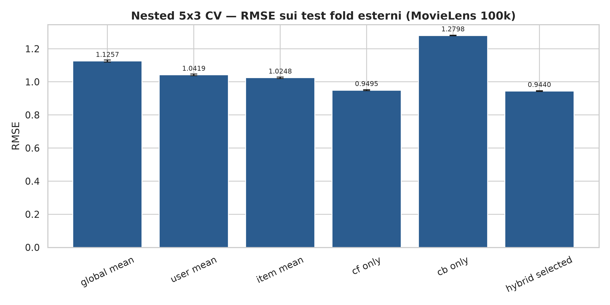
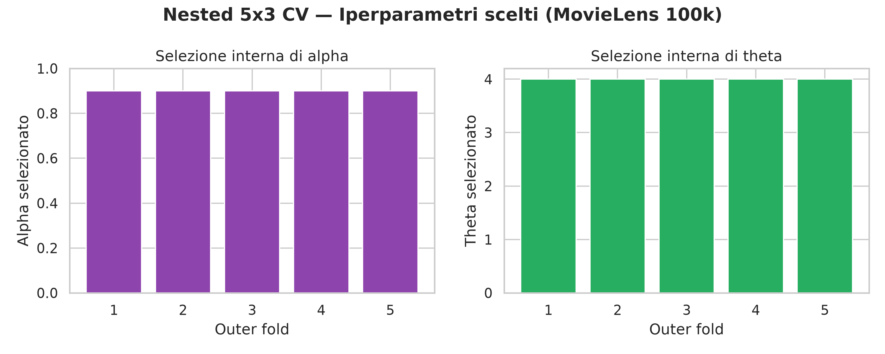
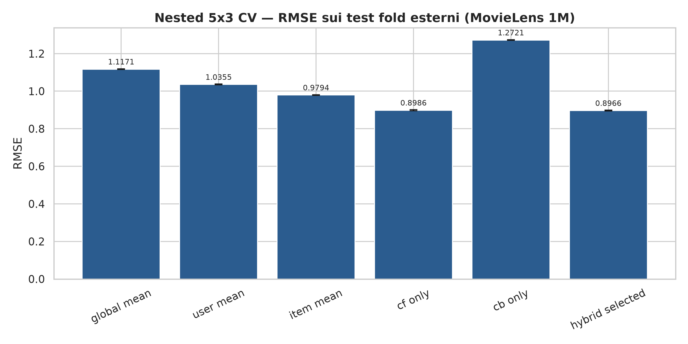

# Relazione di Progetto: Sistema di Raccomandazione Ibrido per SII
## Valutazione riproducibile mediante Nested Cross-Validation

**Corso:** Sistemi Intelligenti per Internet (SII)  
**Anno Accademico:** 2025/2026  
**Studente:** Cristian Perniconi — Matricola: 566835

---

## Abstract

Il progetto confronta Collaborative Filtering (CF), Content-Based Filtering (CB) e una fusione ibrida pesata sui dataset MovieLens 100k e MovieLens 1M. Per evitare che il test influisca sulla scelta degli iperparametri, ogni risultato finale è stimato con una nested cross-validation: cinque fold esterni costituiscono test indipendenti e, per ciascuno, tre fold interni selezionano `alpha` e la soglia del profilo CB `theta`. 

## 1. Protocollo sperimentale

- **Split:** nested K-Fold con 5 fold esterni e 3 fold interni, con seed `42`.
- **Tuning interno:** `alpha ∈ [0.0, 0.1, 0.2, 0.3, 0.4, 0.5, 0.6, 0.7, 0.8, 0.9, 1.0]` e `theta ∈ [3.0, 4.0]`; il criterio di selezione è l’RMSE medio sui validation fold interni.
- **Valutazione finale:** dopo il tuning, CF e CB vengono riaddestrati sull’intero training outer e misurati una sola volta sul test outer.
- **Top-N:** candidati = catalogo meno item osservati dall’utente nel training outer; rilevante = rating nel test outer ≥ 4.0; massimo 500 utenti idonei per fold, campionati deterministicamente quando necessario.
- **Cold item:** item con al più 2 rating nel training outer; il filtro non consulta mai le frequenze del test.
- **Statistiche:** paired t-test e Wilcoxon sono applicati ai cinque RMSE dei test outer appaiati. Con cinque osservazioni il Wilcoxon bilaterale ha potenza limitata e viene interpretato con cautela.

## 2. Modelli

Il CF usa TruncatedSVD sulla matrice sparsa dei residui con bias marginali. Il CB costruisce un profilo utente dai film positivi, usando 19 indicatori di genere armonizzati e l’anno normalizzato.

### 2.1 Significato e ruolo della soglia $\theta$ nel Content-Based

La soglia $\theta$ stabilisce quali rating dell’utente vengono considerati positivi per costruire il profilo contenutistico. Formalmente, il profilo viene calcolato sui soli film appartenenti all’insieme $R_u^+(\theta)=\{i:r_{u,i}\geq\theta\}$. Nel progetto sono confrontate due configurazioni: $\theta=3.0$, che include i film valutati 3, 4 o 5, e $\theta=4.0$, che include soltanto i film valutati 4 o 5.

$$\mathbf{p}_u(\theta)=\frac{\sum_{i\in R_u^+(\theta)}r_{u,i}\mathbf{v}_i}{\sum_{i\in R_u^+(\theta)}r_{u,i}}.$$

La scelta di $\theta$ modifica direttamente la composizione del profilo: con $\theta=3.0$ il profilo contiene più film ma anche preferenze moderate; con $\theta=4.0$ il profilo è più selettivo e rappresenta soprattutto i gusti forti dell’utente. Di conseguenza cambiano la cosine similarity, il rating CB e la correzione che il CB può applicare alla predizione CF. Se nessun rating supera la soglia, l’implementazione usa lo storico disponibile dell’utente come fallback.

Nel modello ibrido, $\theta$ non è un peso indipendente da $\alpha$: determina il contenuto del segnale CB che viene poi pesato da $(1-\alpha)$. Con $\alpha=0.9$, la scelta di $\theta$ influenza il 10% della predizione ibrida. Un profilo più selettivo può migliorare la coerenza semantica della correzione, ma può anche ridurne la copertura; per questo $\theta$ viene selezionato nella CV interna insieme ad $\alpha$, senza usare l’outer test.

La nested CV ha selezionato $\theta=4.0$ in tutti i cinque outer fold di entrambi i dataset. Questo risultato indica che, con le feature disponibili (generi e anno), includere soltanto i film valutati almeno 4 produce una correzione CB più utile rispetto a includere anche i rating pari a 3.

Il modello primario combina direttamente predizioni di rating già limitate alla scala MovieLens:

$$\hat{r}^{\mathrm{Hybrid}}_{u,i}=\operatorname{clip}\left(\alpha\hat{r}^{\mathrm{CF}}_{u,i}+(1-\alpha)\hat{r}^{\mathrm{CB}}_{u,i},\,1,\,5\right).$$

Questa scelta elimina la normalizzazione min-max dipendente dal batch: una predizione e il suo ordinamento non cambiano se il batch di candidati viene riordinato o suddiviso.

## 3. Risultati

### 3.1 MovieLens 100k

Il dataset contiene 100,000 rating, 943 utenti e 1,682 film; la sparsità della matrice è 93.70%.

| Modello | RMSE (mean ± std) | MAE (mean ± std) |
|---|---:|---:|
| global_mean | 1.1257 ± 0.0060 | 0.9447 ± 0.0056 |
| user_mean | 1.0419 ± 0.0048 | 0.8349 ± 0.0051 |
| item_mean | 1.0248 ± 0.0045 | 0.8174 ± 0.0051 |
| cf_only | 0.9495 ± 0.0029 | 0.7428 ± 0.0025 |
| cb_only | 1.2798 ± 0.0018 | 1.0182 ± 0.0026 |
| hybrid_selected | 0.9440 ± 0.0027 | 0.7417 ± 0.0026 |

#### Ranking Top-N

| Modello | Precision@5 | NDCG@5 | Precision@10 | NDCG@10 | Supporto utenti |
|---|---:|---:|---:|---:|---:|
| cf_only | 0.0165 ± 0.0035 | 0.0214 ± 0.0041 | 0.0106 ± 0.0021 | 0.0162 ± 0.0031 | 2500 |
| cb_only | 0.0181 ± 0.0019 | 0.0196 ± 0.0025 | 0.0150 ± 0.0016 | 0.0193 ± 0.0026 | 2500 |
| hybrid_selected | 0.0058 ± 0.0013 | 0.0075 ± 0.0018 | 0.0074 ± 0.0017 | 0.0085 ± 0.0020 | 2500 |

#### Cold-item

Supporto complessivo: 679 rating test; 504 occorrenze di item cold conteggiate nei fold, di cui 150 con zero interazioni nel training (fold validi: 5).

| Modello | Cold RMSE (mean ± std) | Cold MAE (mean ± std) |
|---|---:|---:|
| cf_only | 1.3348 ± 0.0906 | 1.0186 ± 0.0929 |
| cb_only | 1.3451 ± 0.0926 | 1.0971 ± 0.1102 |
| user_mean | 1.0852 ± 0.0586 | 0.8635 ± 0.0406 |
| hybrid_selected | 1.2674 ± 0.0906 | 0.9801 ± 0.0817 |
| hybrid_alpha_0_5 | 1.1405 ± 0.0878 | 0.9150 ± 0.0643 |

#### Significatività e rilevanza pratica

Per Hybrid selezionato contro CF-only, la differenza media RMSE (Hybrid − CF) è -0.005496, con IC 95% [-0.006549, -0.004443]. Il paired t-test restituisce `t=-14.4911`, `p=0.00013185`; il Wilcoxon bilaterale restituisce `W=0.0000`, `p=0.0625`. Un’eventuale significatività deve essere letta insieme alla dimensione dell’effetto, non come prova autonoma di un grande beneficio pratico.

### 3.2 MovieLens 1M

Il dataset contiene 1,000,209 rating, 6,040 utenti e 3,883 film; la sparsità della matrice è 95.74%.

| Modello | RMSE (mean ± std) | MAE (mean ± std) |
|---|---:|---:|
| global_mean | 1.1171 ± 0.0018 | 0.9339 ± 0.0014 |
| user_mean | 1.0355 ± 0.0024 | 0.8289 ± 0.0024 |
| item_mean | 0.9794 ± 0.0022 | 0.7823 ± 0.0020 |
| cf_only | 0.8986 ± 0.0029 | 0.7018 ± 0.0027 |
| cb_only | 1.2721 ± 0.0018 | 1.0107 ± 0.0015 |
| hybrid_selected | 0.8966 ± 0.0027 | 0.7044 ± 0.0025 |

#### Ranking Top-N

| Modello | Precision@5 | NDCG@5 | Precision@10 | NDCG@10 | Supporto utenti |
|---|---:|---:|---:|---:|---:|
| cf_only | 0.0214 ± 0.0028 | 0.0254 ± 0.0028 | 0.0153 ± 0.0039 | 0.0206 ± 0.0034 | 2500 |
| cb_only | 0.0158 ± 0.0025 | 0.0175 ± 0.0019 | 0.0147 ± 0.0019 | 0.0178 ± 0.0023 | 2500 |
| hybrid_selected | 0.0263 ± 0.0036 | 0.0295 ± 0.0042 | 0.0241 ± 0.0030 | 0.0286 ± 0.0035 | 2500 |

#### Cold-item

Supporto complessivo: 550 rating test; 425 occorrenze di item cold conteggiate nei fold, di cui 135 con zero interazioni nel training (fold validi: 5).

| Modello | Cold RMSE (mean ± std) | Cold MAE (mean ± std) |
|---|---:|---:|
| cf_only | 1.3402 ± 0.1134 | 1.0553 ± 0.1081 |
| cb_only | 1.4286 ± 0.0695 | 1.1529 ± 0.0746 |
| user_mean | 1.1821 ± 0.0992 | 0.9494 ± 0.0760 |
| hybrid_selected | 1.2915 ± 0.1122 | 1.0249 ± 0.1021 |
| hybrid_alpha_0_5 | 1.2226 ± 0.1004 | 0.9704 ± 0.0795 |

#### Significatività e rilevanza pratica

Per Hybrid selezionato contro CF-only, la differenza media RMSE (Hybrid − CF) è -0.002028, con IC 95% [-0.002467, -0.001589]. Il paired t-test restituisce `t=-12.8202`, `p=0.000213383`; il Wilcoxon bilaterale restituisce `W=0.0000`, `p=0.0625`. Un’eventuale significatività deve essere letta insieme alla dimensione dell’effetto, non come prova autonoma di un grande beneficio pratico.

## 4. Discussione: contributo distinto di CF e CB

La nested CV separa il contributo dei due rami perché misura CF-only, CB-only e Hybrid sugli stessi outer test fold. Il risultato non va letto come una semplice gara fra modelli: CF e CB forniscono segnali diversi, con utilità che dipende da scala del dataset, metrica e disponibilità di interazioni.

### 4.1 Contributo del Collaborative Filtering

Il CF è il **motore predittivo principale**. I bias utente/item e i fattori latenti appresi dalla TruncatedSVD sfruttano le correlazioni collettive tra valutazioni: per questo il CF ricostruisce meglio il rating individuale rispetto ai soli metadati descrittivi. Il suo vantaggio aumenta quando ogni item e utente dispone di più interazioni, perché i fattori latenti sono stimati con evidenza più stabile.

- **MovieLens 100k:** CF-only ottiene RMSE `0.9495`, contro `1.2798` di CB-only (vantaggio assoluto CF di `0.3304`). Questo quantifica che generi e anno non sostituiscono il segnale collaborativo per la predizione puntuale.
- **MovieLens 1M:** CF-only ottiene RMSE `0.8986`, contro `1.2721` di CB-only (vantaggio assoluto CF di `0.3735`). Questo quantifica che generi e anno non sostituiscono il segnale collaborativo per la predizione puntuale.

Il CF, tuttavia, non possiede una nozione semantica esplicita di contenuto: due film possono essere vicini nello spazio latente anche se non condividono generi, e un item con poche interazioni ha fattori meno affidabili. Questi limiti sono lo spazio in cui il CB può essere complementare.

### 4.2 Contributo del Content-Based Filtering

Il CB costruisce un profilo dai film positivamente valutati e confronta tale profilo con i vettori item basati su generi e anno. Il suo apporto è quindi **semantico e locale**: favorisce item coerenti con preferenze esplicite anche quando il segnale collaborativo è debole. Non è però competitivo come predittore di rating autonomo, perché 20 feature poco ricche non rappresentano registi, attori, temi, tag o caratteristiche narrative.

- **MovieLens 100k:** CB-only ottiene Precision@5 `0.0181`, rispetto a `0.0165` del CF. Il confronto mostra che il CB può ordinare item rilevanti in alcuni contesti, pur avendo un RMSE molto più elevato; ranking e predizione del rating sono quindi obiettivi distinti.
- **MovieLens 1M:** CB-only ottiene Precision@5 `0.0158`, rispetto a `0.0214` del CF. Il confronto mostra che il CB può ordinare item rilevanti in alcuni contesti, pur avendo un RMSE molto più elevato; ranking e predizione del rating sono quindi obiettivi distinti.

### 4.3 Contributo di CF e CB *dentro* la predizione ibrida

Nel modello ibrido CF e CB non contribuiscono allo stesso modo: la predizione usa direttamente i due rating sulla medesima scala MovieLens,

$$\hat{r}^{\mathrm{Hybrid}}_{u,i}=\alpha\hat{r}^{\mathrm{CF}}_{u,i}+(1-\alpha)\hat{r}^{\mathrm{CB}}_{u,i}.$$

Riscrivendo la formula rispetto alla previsione CF si ottiene `r_Hybrid − r_CF = (1−alpha) · (r_CB − r_CF)`. Il CF fornisce quindi la previsione di base; il CB sposta tale previsione solo in proporzione al suo peso e al disaccordo fra i due modelli. Se CF e CB concordano, il CB non modifica il risultato; se il CB assegna un rating maggiore/minore, applica una correzione positiva/negativa.

- **MovieLens 100k:** la CV interna ha selezionato `alpha=0.9 (5/5 fold)` e `theta=4.0 (5/5 fold)`. In pratica il CF pesa in media `90%` e il CB `10%`; `theta=4.0` indica che il profilo CB usa soltanto film valutati almeno 4 dall’utente.
- **MovieLens 1M:** la CV interna ha selezionato `alpha=0.9 (5/5 fold)` e `theta=4.0 (5/5 fold)`. In pratica il CF pesa in media `90%` e il CB `10%`; `theta=4.0` indica che il profilo CB usa soltanto film valutati almeno 4 dall’utente.

Nel caso osservato, `alpha=0.9` in tutti i fold significa che l’ibrido non fa una media paritaria: è un **CF dominante con correzione CB del 10%**. In formule, `r_Hybrid = r_CF + 0.1 · (r_CB − r_CF)`. Il CB non può quindi ribaltare da solo una predizione CF molto diversa, ma può modificare l’ordine di item con score CF vicini; questo è precisamente il meccanismo di *tie-breaking* che può incidere sul Top-N più che sull’RMSE globale.

Il ruolo di `theta=4.0` è altrettanto importante: la correzione CB viene calcolata da un profilo costruito solo con i titoli che l’utente ha apprezzato molto. Il 10% CB non rappresenta dunque un generico segnale di genere, ma una piccola spinta verso film simili alle preferenze forti dell’utente.

#### Effetto misurato della correzione CB

- **MovieLens 100k:** rispetto alla base CF, la correzione CB del peso selezionato porta l’RMSE da `0.9495` a `0.9440` (-0.0055; -0.58%). Nel ranking, peggiora Precision@5 da `0.0165` a `0.0058` (-65.0%) e NDCG@5 da `0.0214` a `0.0075` (-64.9%).
- **MovieLens 1M:** rispetto alla base CF, la correzione CB del peso selezionato porta l’RMSE da `0.8986` a `0.8966` (-0.0020; -0.23%). Nel ranking, migliora Precision@5 da `0.0214` a `0.0263` (+23.2%) e NDCG@5 da `0.0254` a `0.0295` (+16.1%).

Il contributo CB è quindi **condizionale**. Su ML-1M, il 10% di correzione semantica migliora il ranking perché il CF produce una base latente già solida e il CB aiuta a discriminare candidati vicini. Su ML-100k, la stessa correzione migliora leggermente RMSE ma peggiora il Top-N: la preferenza di genere non si allinea sempre con gli item rilevanti nel test. Il risultato mostra che il CB contribuisce come regolatore/tie-breaker, non come sostituto del CF; un peso scelto per RMSE non è necessariamente il peso ottimale per ranking.

### 4.4 Cold-item e decisione operativa

Nel cold-item, un peso CB più alto può attenuare l’incertezza del CF, ma i metadati disponibili non sono sufficienti a superare una stima robusta della media personale dell’utente. I risultati riportano sia l’ibrido selezionato per RMSE globale sia `alpha=0.5` come controllo esplorativo, senza presentare quest’ultimo come configurazione ottimizzata.

- **MovieLens 100k:** Cold RMSE CF=`1.3348`, Hybrid selezionato=`1.2674`, Hybrid `alpha=0.5`=`1.1405`, User Mean=`1.0852`. L’ibrido migliora il CF, ma User Mean resta il riferimento più stabile nello scenario estremo.
- **MovieLens 1M:** Cold RMSE CF=`1.3402`, Hybrid selezionato=`1.2915`, Hybrid `alpha=0.5`=`1.2226`, User Mean=`1.1821`. L’ibrido migliora il CF, ma User Mean resta il riferimento più stabile nello scenario estremo.

**Sintesi:** usare il CF come base per l’accuratezza dei rating; usare il CB come complemento per aumentare la coerenza semantica, specialmente nel ranking di cataloghi più ricchi e per attenuare il cold-item. Per un sistema operativo, una possibile evoluzione è un peso adattivo: più CF per item popolari, più CB per item con poca evidenza, e selezione di `alpha` separata per RMSE e per ranking quando l’obiettivo primario è Top-N.

### 4.5 Limiti metodologici

La nested CV rimuove l’ottimismo dovuto alla scelta di `alpha` e `theta` sugli stessi fold di test. Rimangono limiti espliciti: lo split è casuale per interazioni e misura soprattutto la predizione di rating mancanti, non un vero scenario temporale; le feature CB sono limitate a generi e anno; il ranking ML-1M usa un campione deterministico di utenti per contenere i costi. Il cold-item valuta la scarsità di item, non il cold-user, e una baseline User Mean può restare competitiva perché non dipende dalla stima dell’item.

## 5. Riproducibilità

Eseguire `python run_pipeline.py` dopo l’installazione di `requirements.txt`. La pipeline rigenera il manifest `report/experiment_manifest.json`, i risultati versionati `report/experiment_results.json`, il riepilogo `report/nested_results.md`, figure e questa relazione. Il JSON conserva seed, ambiente, configurazioni scelte e metriche per fold.

## Bibliografia

1. Ricci, F., Rokach, L., & Shapira, B. (2015). *Recommender Systems Handbook*. Springer.
2. Koren, Y., Bell, R., & Volinsky, C. (2009). *Matrix factorization techniques for recommender systems*. Computer, 42(8), 30–37.
3. GroupLens Research. *MovieLens Datasets*. https://grouplens.org/datasets/movielens/
