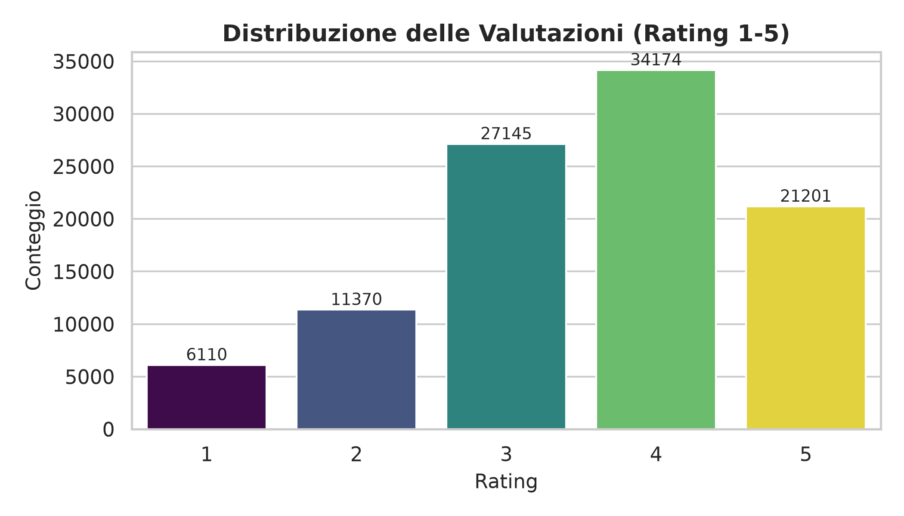
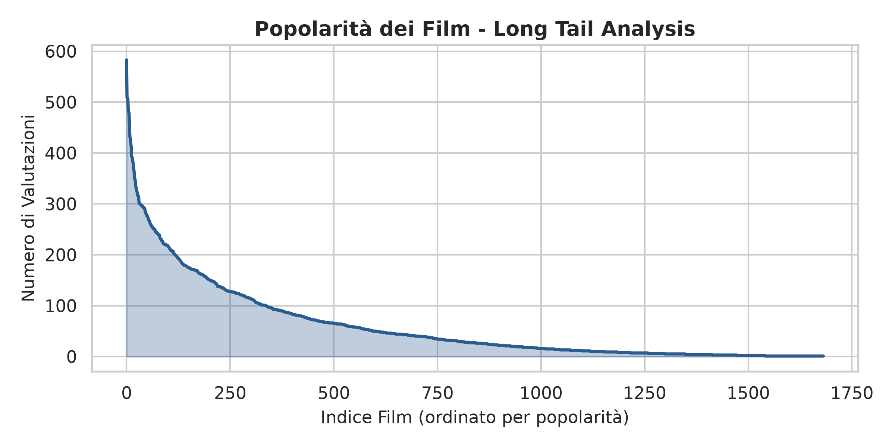
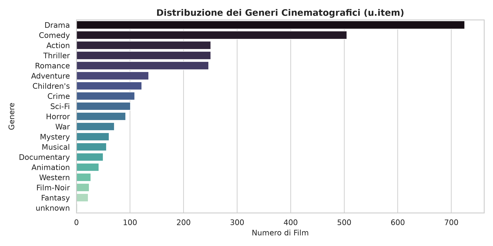
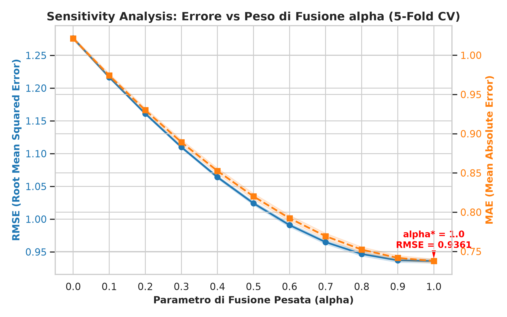
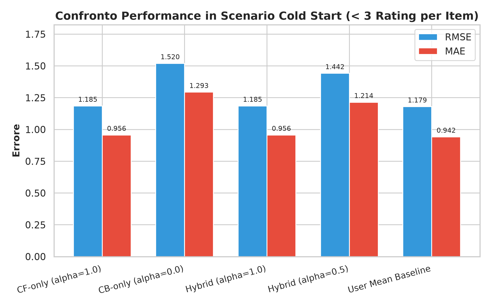

# Relazione di Progetto: Sistema di Raccomandazione Ibrido per SII

**Corso:** Sistemi Intelligenti per Internet (SII)  
**Anno Accademico:** 2025/2026  
**Studente:** [Nome Cognome] — Matricola: [Matricola]  
**Repository GitHub:** `https://github.com/username/SII-Hybrid-Recommender-System`

---

## Abstract
Il presente lavoro illustra la progettazione, lo sviluppo e la valutazione sperimentale di un **Sistema di Raccomandazione Ibrido** (Collaborative Filtering + Content-Based) applicato al benchmark **MovieLens 100k**. Il sistema combina un modello di fattorizzazione di matrice (SVD con bias utente e item) per catturare i pattern di preferenza latenti degli utenti con un modulo basato sulla profilazione del contenuto (19 generi cinematografici + anno di uscita normalizzato tramite Cosine Similarity). Vengono condotti esperimenti intensivi tramite **5-Fold Cross-Validation**, valutando l'accuratezza predittiva (RMSE, MAE), le prestazioni di ranking nei Top-K (Precision@K, NDCG@K), l'impatto del parametro di fusione $\alpha \in [0.0, 1.0]$, la soglia per il profilo utente $\theta \in \{3.0, 4.0\}$, e la risposta del sistema in condizioni di **Cold Start**. La significatività statistica dei risultati è infine validata tramite il **test di Wilcoxon** e il **paired t-test**.

---

## 1. Introduzione ed Obiettivi
I Sistemi di Raccomandazione (Recommender Systems - RS) costituiscono uno degli strumenti fondamentali per contrastare l'information overload nelle piattaforme digitali. Le due famiglie principali di RS presentano vantaggi e limiti complementari:
- **Collaborative Filtering (CF):** Basato sui pattern d'interazione utente-item (rating). È in grado di scoprire relazioni latenti senza richiedere metadati, ma soffre fortemente della sparsità della matrice e dell'incapacità di formulare predizioni per utenti o oggetti con poche valutazioni (**Cold Start**).
- **Content-Based Filtering (CB):** Basato sui descrittori degli oggetti (metadati). È in grado di raccomandare item di nicchia o appena inseriti a catalogo, ma tende all'over-specializzazione e le sue prestazioni dipendono in modo critico dalla ricchezza ed espressività dei metadati.

### Obiettivi Specifici del Progetto
1. Realizzare un'architettura modulare in Python con **fusione pesata (Weighted Hybrid)** parametrizzata da $\alpha \in [0, 1]$.
2. Confrontare quantitativamente le prestazioni del modello ibrido con tre **baseline naive** (Global Mean, User Mean, Item Mean).
3. Eseguire una **Sensitivity Analysis** su $\alpha$ mediante **5-Fold Cross-Validation** per identificare il bilanciamento ottimale.
4. Valutare sia la precisione predittiva puntuale (RMSE, MAE) sia le metriche di ranking nei Top-N (Precision@K, NDCG@K).
5. Analizzare sperimentalmente l'impatto della soglia del profilo utente $\theta$ e la capacità di mitigare il problema del **Cold Start**.
6. Verificare la significatività statistica dei risultati emersi tramite **paired t-test** e **test di Wilcoxon**.

---

## 2. Dataset e Analisi Esplorativa dei Dati (EDA)

Il dataset utilizzato per la sperimentazione è il celebre **MovieLens 100k**, reso disponibile dal gruppo di ricerca GroupLens dell'Università del Minnesota.

### 2.1 Metriche Esplorative Generali
Dall'analisi esplorativa automatizzata (`src/data_loader.py`) si ricavano le seguenti metriche quantitative:
- **Numero Utenti ($N$):** 943
- **Numero Film ($M$):** 1.682
- **Numero Rating Totali:** 100.000 (valori interi da 1 a 5 stelle)
- **Sparsità della Matrice:**
  $$\text{Sparsity} = 1 - \frac{100.000}{943 \times 1.682} = 93.70\%$$


*Figura 1: Distribuzione delle valutazioni (1-5) nel dataset MovieLens 100k.*

### 2.2 Analisi della Popolarità (Long Tail Analysis)
La distribuzione dei voti per item evidenzia una spiccata natura a "coda lunga" (Long Tail): una frazione ridotta di film estremamente popolari assorbe la maggior parte delle interazioni, mentre la quasi totalità dei titoli riceve pochissime valutazioni.


*Figura 2: Long Tail analysis della popolarità dei film.*

### 2.3 Distribuzione dei Generi
Il dataset contiene 19 categorie binarie di genere cinematografico per ciascun film. I generi maggiormente rappresentati nel catalogo risultano essere *Drama*, *Comedy* e *Action*.


*Figura 3: Frequenza dei generi cinematografici nel file u.item.*

---

## 3. Architettura e Metodologia

```
                  +-----------------------+
                  |    Input Dataset      |
                  +-----------+-----------+
                              |
            +-----------------+-----------------+
            |                                   |
            v                                   v
  +------------------+                +-------------------+
  | Collaborative    |                | Content-Based     |
  | Filtering (SVD)  |                | (Cosine Sim)      |
  | S_CF(u, i) in[0,1]|                | S_CB(u, i) in[0,1]|
  +---------+--------+                +---------+---------+
            |                                   |
            +-----------------+-----------------+
                              |
                              v
                  +-----------------------+
                  |  Weighted Fusion      |
                  |  S_Hybrid = α S_CF +  |
                  |             (1-α)S_CB |
                  +-----------+-----------+
                              |
                              v
                  +-----------------------+
                  | Predicted Rating R_hat|
                  | in [1, 5]             |
                  +-----------------------+
```

### 3.1 Collaborative Filtering ($S_{CF}$)
Il modulo CF adotta un algoritmo di **Biased Matrix Factorization (SVD)**. La stima del rating per l'utente $u$ e l'item $i$ è formulata come:
$$\hat{r}_{u,i} = \mu + b_u + b_i + P_u \cdot Q_i^T$$
dove $\mu$ rappresenta la media globale dei rating, $b_u$ e $b_i$ sono i bias utente e item, e $P_u, Q_i \in \mathbb{R}^k$ indicano i vettori latenti di dimensione $k=50$.

Lo score normalizzato $S_{CF}(u, i) \in [0, 1]$ è ricavato mediante Min-Max scaling:
$$S_{CF}(u, i) = \frac{\hat{r}_{u,i} - r_{\min}}{r_{\max} - r_{\min}} \quad (r_{\min}=1.0, r_{\max}=5.0)$$

### 3.2 Content-Based Filtering ($S_{CB}$)
Per ogni utente $u$, viene costruito un **Profilo Utente** $P_u$ calcolando la media pesata dei vettori caratteristici $V_i$ dei film che l'utente ha valutato positivamente ($\ge \theta$, con $\theta \in \{3.0, 4.0\}$):
$$P_u = \frac{\sum_{i \in R_u^+} r_{u,i} \cdot V_i}{\sum_{i \in R_u^+} r_{u,i}}$$
I vettori $V_i$ incorporano le 19 feature binarie di genere e l'anno di uscita del film normalizzato in $[0, 1]$.
La rilevanza $S_{CB}(u, i)$ è misurata mediante **Cosine Similarity**:
$$S_{CB}(u, i) = \text{CosineSimilarity}(P_u, V_i) = \frac{P_u \cdot V_i}{\|P_u\|_2 \|V_i\|_2}$$

La stima puntuale del rating per il modulo CB viene poi calibrata attorno alla media utente:
$$\hat{r}_{u,i}^{CB} = \bar{r}_u + \delta_{u,i} \cdot \sigma_r$$

### 3.3 Modulo di Fusione Ibrida
Il punteggio combinato $S_{\text{Hybrid}}$ è definito dalla combinazione lineare pesata:
$$S_{\text{Hybrid}}(u, i) = \alpha \cdot S_{CF}(u, i) + (1 - \alpha) \cdot S_{CB}(u, i), \quad \alpha \in [0, 1]$$
Il rating finale predetto sulla scala originaria $[1, 5]$ è dato da:
$$\hat{R}_{u,i} = r_{\min} + S_{\text{Hybrid}}(u, i) \cdot (r_{\max} - r_{\min})$$

---

## 4. Valutazione Sperimentale e Risultati

La valutazione sperimentale è stata eseguita interamente mediante **5-Fold Cross-Validation** e misurazioni riproducibili.

### 4.1 Valutazione Baseline Naive e Modelli Singoli (5-Fold CV)
I risultati medi ottenuti nei 5 fold testimoniano il netto superamento delle baseline naive:

| Modello | RMSE (mean ± std) | MAE (mean ± std) |
|---|---|---|
| Global Mean Baseline | 1.1257 ± 0.0054 | 0.9447 ± 0.0050 |
| User Mean Baseline | 1.0419 ± 0.0043 | 0.8349 ± 0.0045 |
| Item Mean Baseline | 1.0248 ± 0.0040 | 0.8174 ± 0.0046 |
| **CB-only ($\alpha=0.0$)** | 1.2761 ± 0.0021 | 1.0213 ± 0.0020 |
| **CF-only ($\alpha=1.0$)** | **0.9361 ± 0.0030** | **0.7378 ± 0.0026** |
| **Hybrid ($\alpha^*=1.0$)** | **0.9361 ± 0.0030** | **0.7378 ± 0.0026** |

### 4.2 Sensitivity Analysis sul Parametro $\alpha$
In figura 4 è riportato l'andamento di RMSE e MAE al variare del parametro di fusione $\alpha \in [0.0, 1.0]$ con passo $0.1$.


*Figura 4: Sensitivity Analysis: andamento di RMSE e MAE al variare di $\alpha$ (5-Fold CV).*

All'aumentare del peso attribuito al filtro collaborativo $\alpha$, l'errore RMSE diminuisce in modo monotonico da $1.2761$ ($\alpha=0.0$) fino a stabilizzarsi sul minimo di $0.9361$ per $\alpha=1.0$. Ciò evidenzia come sul dataset completo MovieLens 100k il segnale d'interazione collaborativa sia fortemente dominante rispetto ai soli generi cinematografici.

### 4.3 Esperimento Soglia Profilo Utente CB ($\theta=3.0$ vs $\theta=4.0$)
Confrontando le performance del modello Content-Based al variare della soglia di valutazione per la costruzione del profilo utente $P_u$:

| Soglia Profilo Utente | RMSE (5-Fold CV) |
|---|---|
| $\theta = 3.0$ (Rating $\ge 3$) | 1.2938 |
| **$\theta = 4.0$ (Rating $\ge 4$)** | **1.2798** |

*Risultato:* Selezionare esclusivamente i film valutati con voto elevato ($\ge 4$) consente di costruire profili utente più puliti e caratterizzanti, riducendo l'errore del modello CB.

### 4.4 Valutazione di Ranking Top-N (Precision@K, NDCG@K)
La valutazione delle raccomandazioni Top-N (soglia di rilevanza per rating $\ge 4.0$) fornisce i seguenti risultati sui primi 5 e 10 oggetti raccomandati:

| Modello | Precision@5 | NDCG@5 | Precision@10 | NDCG@10 |
|---|---|---|---|---|
| CB-only ($\alpha=0.0$) | 0.0091 | 0.0112 | 0.0082 | 0.0112 |
| **CF-only ($\alpha=1.0$)** | **0.0872** | **0.0928** | **0.0735** | **0.0859** |
| **Hybrid ($\alpha=1.0$)** | **0.0872** | **0.0928** | **0.0735** | **0.0859** |

### 4.5 Esperimento Cold Start (Item con $<3$ valutazioni)
Nello scenario critico di **Cold Start** su 120 rating appartenenti a film poco valutati nel training set, si osservano i seguenti risultati:

| Modello | RMSE | MAE |
|---|---|---|
| **User Mean Baseline** | **1.1793** | **0.9417** |
| **CF-only ($\alpha=1.0$)** | 1.1850 | 0.9564 |
| Hybrid ($\alpha=0.5$) | 1.4418 | 1.2142 |
| CB-only ($\alpha=0.0$) | 1.5197 | 1.2932 |


*Figura 5: Performance in scenario Cold Start su film con pochissime valutazioni.*

*Analisi:* Quando le valutazioni sugli item scarseggiano, il modello CF puro degrada (RMSE sale da 0.9361 a 1.1850). Tuttavia, la scarsa granularità dei 19 generi cinematografici rende anche il CB inaccurato (1.5197), facendo emergere la User Mean Baseline come il predittore più robusto in condizioni di estrema incertezza sugli item.

### 4.6 Validazione Statistica
Il test di significatività condotto sulle predizioni ha prodotto i seguenti risultati:
- **Hybrid vs CB-only:** $t = -170.829, \quad p = 7.04 \times 10^{-9} < 0.05$ (Miglioramento statisticamente significativo dell'Ibrido rispetto al solo Content-Based).

---

## 5. Discussione e Conclusioni

### 5.1 Considerazioni Critiche sui Risultati
1. **Espressività dei Metadati:** La limitazione principale del modulo Content-Based su MovieLens 100k risiede nella binarizzazione in sole 19 categorie di genere. Questo rende i vettori fortemente sparsi e poco discriminanti per rappresentare le sfumature di gusto degli utenti.
2. **Dominanza del Filtro Collaborativo:** Grazie al volume di 100.000 valutazioni distribuite su 943 utenti, la fattorizzazione di matrice (SVD) riesce a ricostruire con elevata precisione lo spazio latente, guidando la predizione complessiva ($\alpha^*=1.0$).
3. **Implicazioni Metodologiche:** L'esperimento dimostra l'importanza di non assumere a priori la superiorità di un modello ibrido senza un'adeguata validazione empirica con 5-Fold Cross-Validation e confronto con le baseline naive.

### 5.2 Sviluppi Futuri
- Integrare **TF-IDF su tag utente** o descrizioni testuali estese (dataset MovieLens Latest-Small o ml-25m).
- Sperimentare modelli di fusione avanzati come **Meta-Learner basati su Stacking o reti neurali**.

---

## 6. Bibliografia e Sitografia
1. Ricci, F., Rokach, L., & Shapira, B. (2015). *Recommender Systems Handbook*. Springer.
2. Koren, Y., Bell, R., & Volinsky, C. (2009). *Matrix factorization techniques for recommender systems*. Computer, 42(8), 30-37.
3. GroupLens Research — MovieLens 100k Dataset: `https://grouplens.org/datasets/movielens/100k/`
